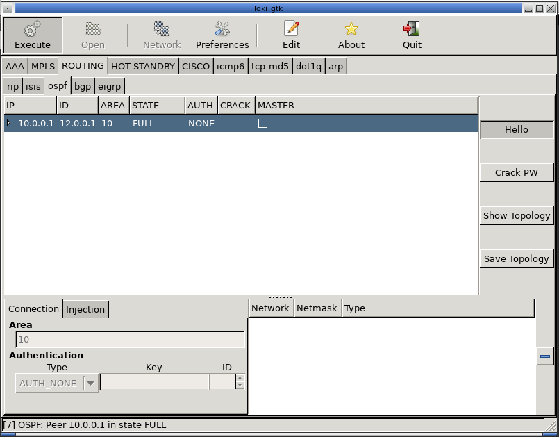

# Loki_on_Kali
Docker container to run Loki on Kali Linux / Parrot-OS. Loki is a python based infrastructure pentesting tool focussing on layer 3 protocols.



# Installation

## Image

### Method 1 : Build your own image

* Build the container :

```
cd Docker
sudo sh ./build.sh
```

### Method 2 : Import from github

* Import the image :

`sudo docker pull ghcr.io/raizo62/loki_on_kali:latest`

* Rename the image to use the launchers

`sudo docker image tag ghcr.io/raizo62/loki_on_kali loki_on_kali`

* Delete the old name of the image

`sudo docker rmi ghcr.io/raizo62/loki_on_kali`

### Method 3 : Download the file of the image

* Get the compressed image :

`wget https://github.com/Raizo62/Loki_on_Kali/releases/download/v1/loki_on_kali_image_v1.docker.tgz`

* Unzip the file :

```
tar xvf loki_on_kali_image_v1.docker.tgz
rm loki_on_kali_image_v1.docker.tgz
```

* Import the image :

`sudo docker load -i loki_on_kali_image_v1.docker`

## Launchers

* Copy launchers in /usr/local/sbin :

```
chmod u+x Docker/run_loki_*.sh
sudo cp Docker/run_loki_*.sh /usr/local/sbin
```

# Play

* Start Loki :

```
sudo run_loki_gtk.sh
```
or
```
sudo run_loki_urw.sh
```
or
```
sudo run_loki_bash.sh
# To run loki, use the command "loki_gtk.py"
```

* The shared folder between Loki and the Host is '/tmp'
